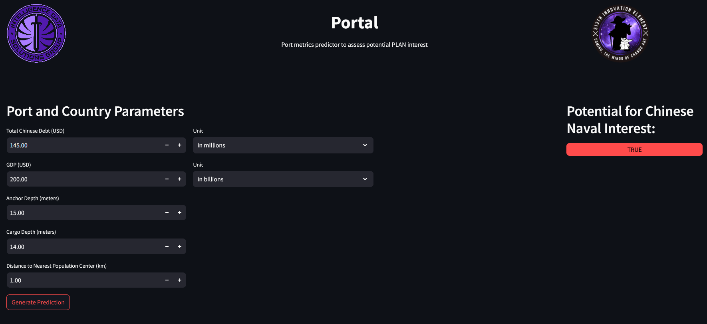

# Port Prediction Model

This repository contains a proof-of-concept application for predicting the potential use of ports by the Chinese Navy based on specific criteria. The project consists of a data processing script to clean and train the model, and a Streamlit frontend to interact with the model.

## Project Structure

- `main.py`: This script cleans the dataset, trains a logistic regression model, and saves the model and scaler for later use.
- `app.py`: This Streamlit application provides a user interface to input port and country parameters, scales the input data, and uses the trained model to predict the potential for Chinese naval interest.

## Files

### `main.py`

This script performs the following tasks:
1. **Data Cleaning**: Reads and processes the `model_data_updated.csv` dataset.
2. **Model Training**: Trains a logistic regression model.
3. **Model Saving**: Saves the trained model and scaler as pickle files.

#### Usage

To run the script and train the model, execute:

```bash
python main.py
```

This will generate `model.pkl` and `scalers.pkl` in the `models` directory.

### `app.py`

This Streamlit application provides the frontend for the port prediction model. Users can input the following parameters:
- Anchor depth of the port (in meters)
- Cargo depth of the port (in meters)
- Distance to the nearest population center (in kilometers)
- Total amount of Chinese debt of that country (in millions or billions in USD)
- GDP of that country (in millions or billions in USD)

The application scales the input data and uses the logistic regression model to determine whether the port meets the criteria for potential Chinese naval use.

#### Usage

To run the Streamlit application, execute:

```bash
streamlit run app.py
```

This will launch the web interface where you can input the port and country parameters and receive a prediction.

## Model Details

The logistic regression model predicts the potential for Chinese naval use based on the given input parameters. The model was trained on a small, custom dataset, so the results should be considered as a proof-of-concept.

## Requirements

- pandas
- scikit-learn
- streamlit
- pickle

Install the required packages using:

```bash
pip install pandas scikit-learn streamlit
```

## Acknowledgements

This project uses a custom dataset compiled from various sources. The application is intended as a proof-of-concept and should not be used for making real-world decisions without further validation.
